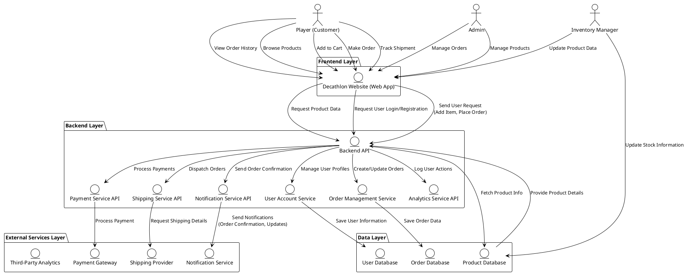
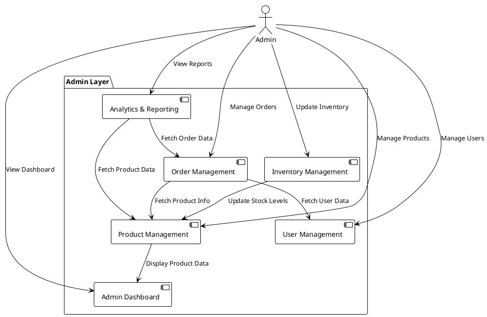
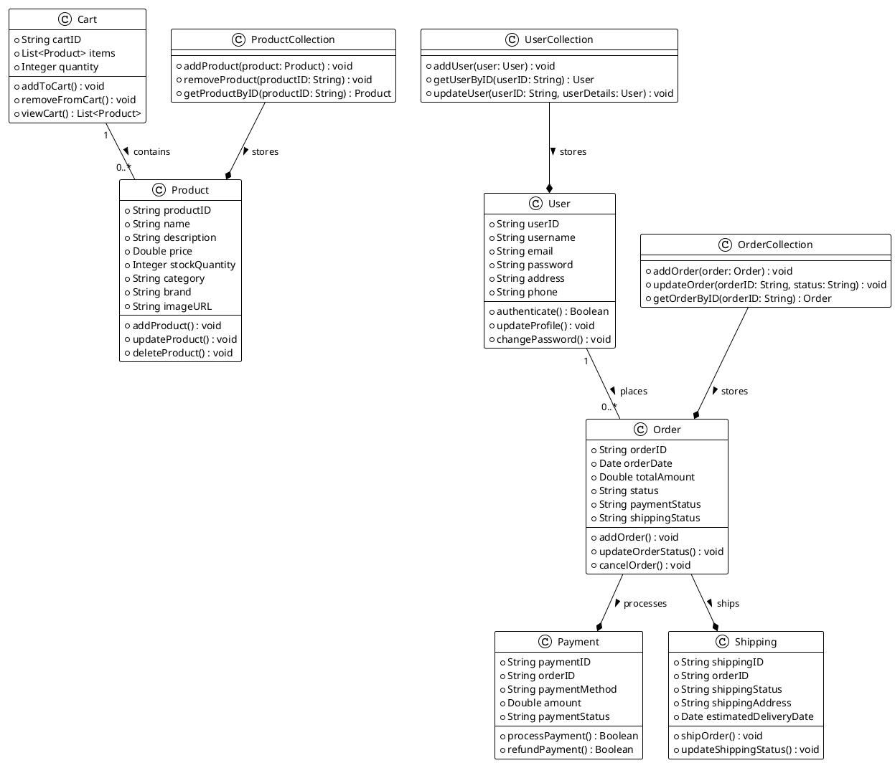
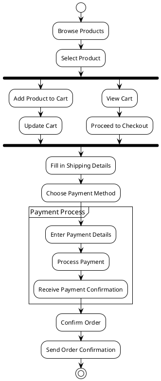
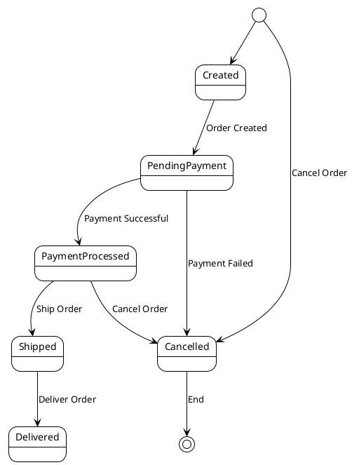
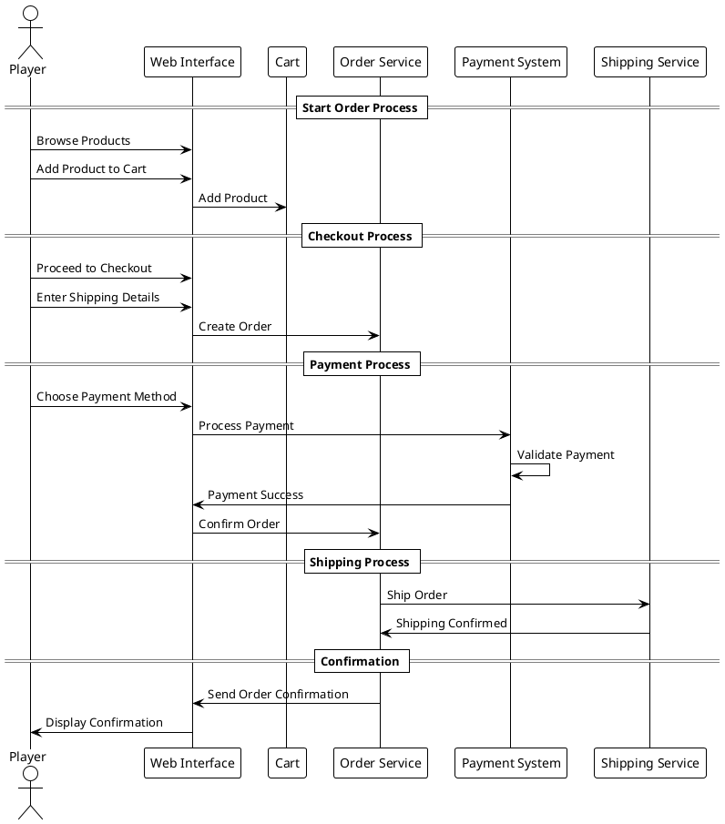
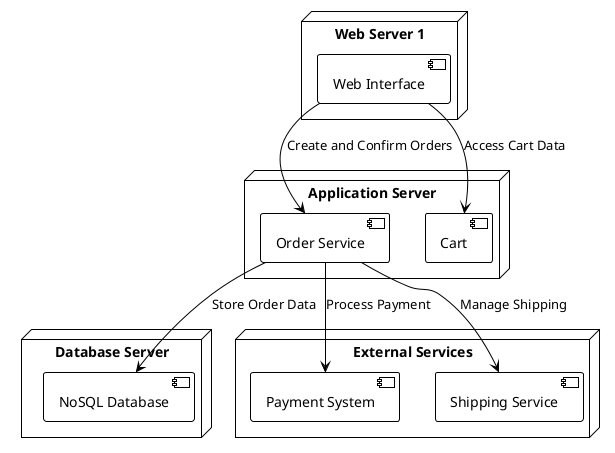
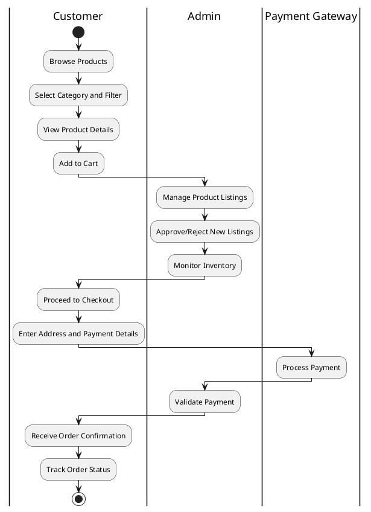

## 1. System Context Diagram

---

## 2. Container Diagram

---

## 3. Component Diagram

---

## 4. Class Diagram

---

## 5. Activity Diagram

---

## 6. State Diagram

---

## 7. Sequence Diagram

---

## 8. Deployment Diagram

---
## 9. Swimlane Diagram

